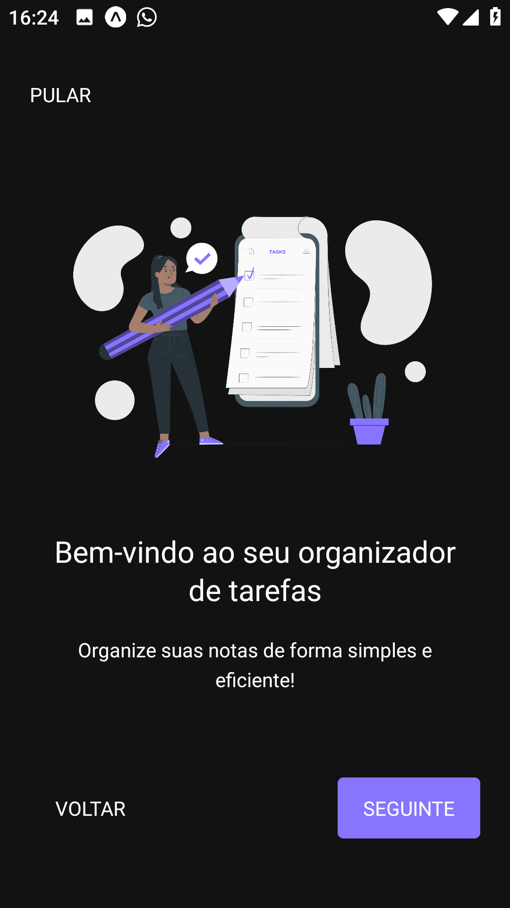
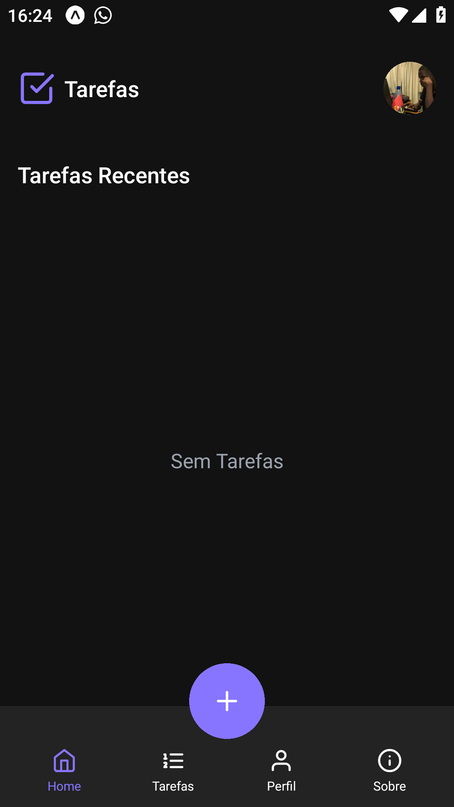
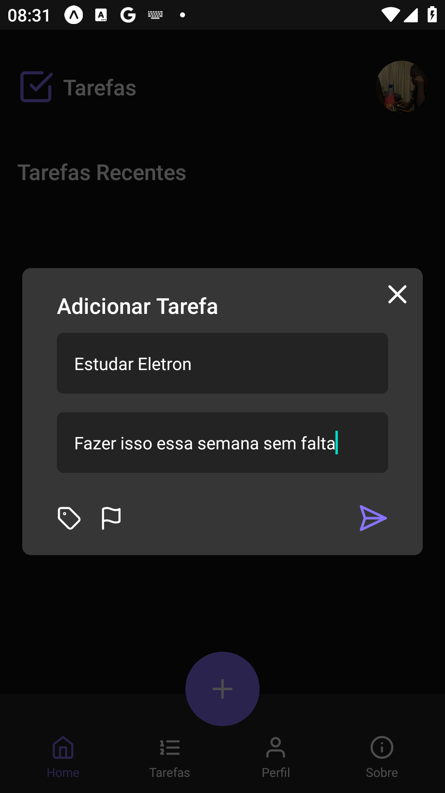
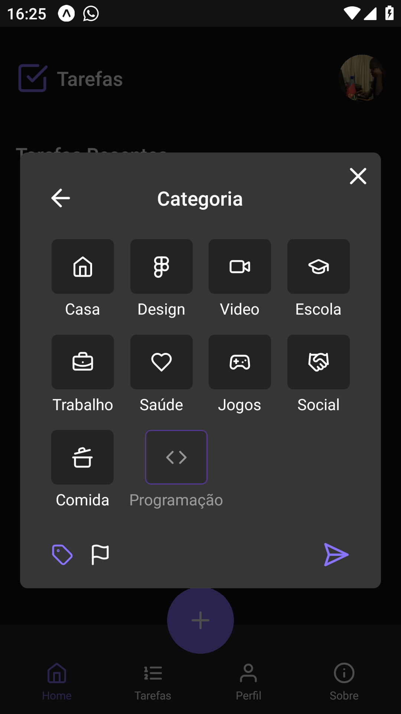
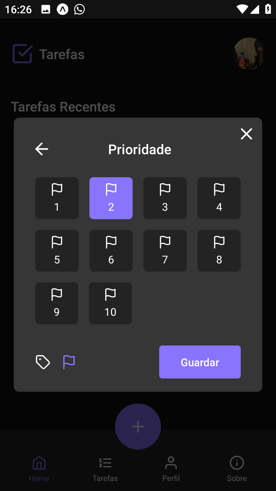
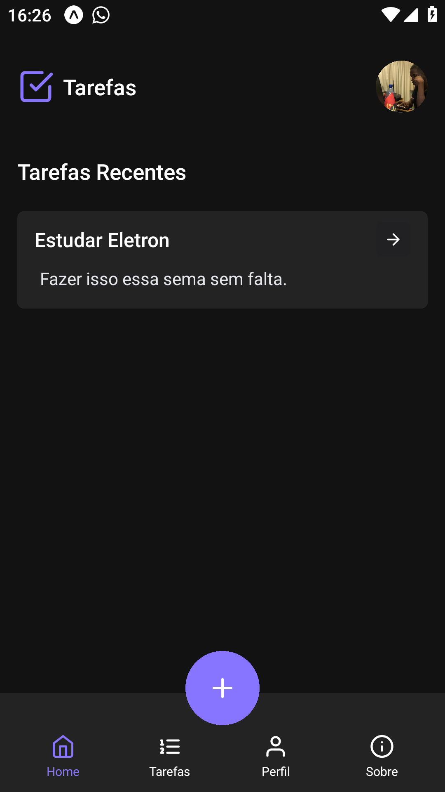
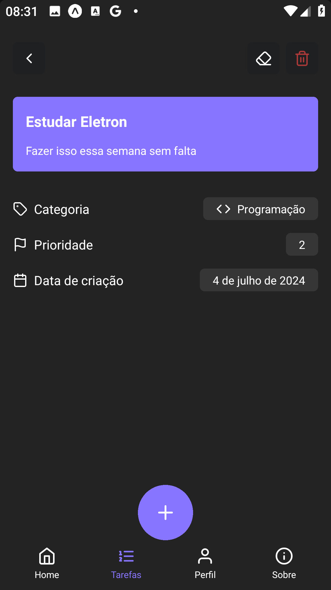
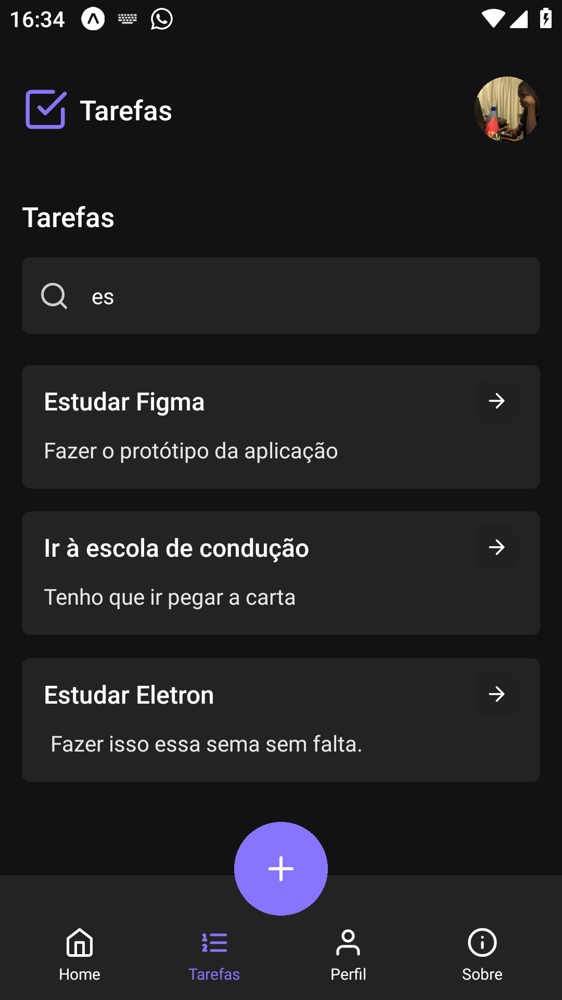

# App gerenciador de tarefas (TaskApp) 

### Este repositório contém o projecto `App Gerenciador de Tarefas`.  Para mais informações sobre o projecto, clique <a href="https://github.com/MauroTwister475/taskApp">aqui</a>

## Imagens após a conclusão do projecto

   <div style="display:flex; flex-wrap: wrap; gap: 30px; margin-top: 50px;">
      
     
     
     
     
     
     
     
     
     
     
     
   </div>

## Técnologias Utilizadas 📌🚀
  - [React Native](https://reactnative.dev/)
  - [Expo](https://docs.expo.dev/)
  - [SQLite](https://docs.expo.dev/versions/latest/sdk/sqlite/)
  - [Nativewind](https://nativewind.dev/)
  - [Zustand](https://zustand-demo.pmnd.rs/)

## Funcionalidades Inplementadas ✅

- `Adicionar nova tarefa`
- `Editar tarefa`
- `Deletar tarefa`
- `Ver tarefas recentes (as 4 mais recentes)`
- `Ver toda as tarefas adicionadas`
- `Filtrar Tarefas por nome (Pesquisa)`

## Requisitos para rodar o projecto:

### Setup de ambiente: 
- Node versão - <a href="https://nodejs.org/dist/v20.11.1/node-v20.11.1-x64.msi">LTS</a> >= 20
- npm (Gerenciador de pacotes que foi utilizado no projecto)

## Como rodar o projeto?👩‍💻🚩

1 - Clone o repositório

```
git clone https://github.com/MauroTwister475/taskApp.git
```

2 - Rode o seguinte comando para instalar todas as dependências necessárias: 
```
npm install ou npx expo install
```

3 -  E por fim, rode o seguinte comando:
```
npm start ou npx expo start
```

## Como me localizar no projecto?

- `@/app`: Pasta onde estão as páginas da aplicação (rotas)
- `@/assets`: Pasta onde contém os arquivos de mídias utilizadas na aplicação (imagens, ícones, etc)
- `@/components`: Pasta onde contém os componenetes reutilizáveis, ou seja que serão usados várias vezes na aplicação
- `@/constants`:  Pasta que contém as constantes da aplicação
- `@/database`:  Pasta que contém a configuração do banco de dados da aplicação
- `@/lib`:  Pasta que contém as configurações de outras libs usadas na aplicação
- `@/screens`:  Pasta que contém interfaces (telas da aplicação)
- `@/stores`:  Pasta que contém os estados globais gerenciavéis da aplicação
- `@/styles`:  Pasta que contém as configurações de estilização da aplicação (nativewind)
- `@/types`: Pasta que contém as interfaces ou types utilizadas na aplicação
- `@/utils`:  Pasta que contém as funções utilitárias da aplicação

## Ver mais sobre mim 🔗🌎

#### Minhas Redes

- Github: https://github.com/MauroTwister475/profile
- Linkedin: https://www.linkedin.com/in/mauro-raimundo-dinis-00475526a/
